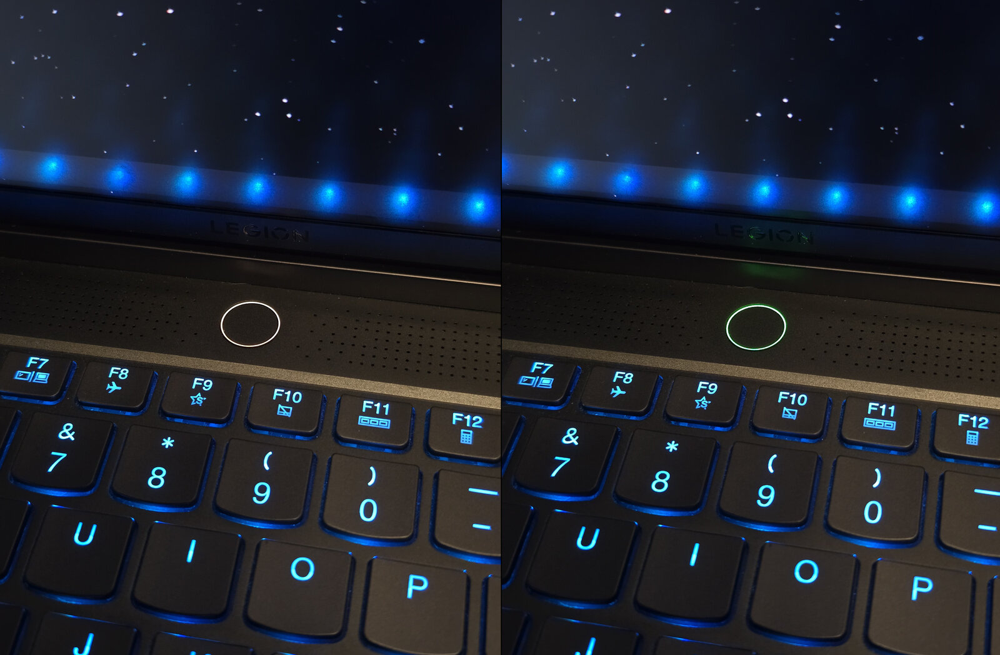

# legion-elan-fp-led



Make the power-button LED on Lenovo Legion laptops flash green while the
fingerprint reader is waiting for a finger, and flash white when the finger
doesn't match, the same way it does under Windows Hello.

On these laptops the fingerprint reader sits in the power button. On Windows
the button's LED flashes green and stays green during a fingerprint prompt,
flashes white after a failed match, then returns to the power-profile colour.
On Linux the Lenovo/ELAN libfprint driver never sends those commands, so the
LED never changes. This project adds
it back with a tiny `LD_PRELOAD` library for `fprintd`; nothing in fprintd,
libfprint or the kernel is modified.

## Does it apply to my machine?

You need **all** of these:

- An **ELAN `04f3:0c4b`** fingerprint reader. Check with `lsusb | grep 04f3:0c4b`
  (it shows as `Elan Microelectronics Corp. ELAN:Fingerprint`).
- The proprietary **libfprint TOD driver for 0c4b** (`libfprint-2-tod1-elan-0c4b`,
  file `libfprint-2-tod1-elan-0c4b.so`) with **libfprint-tod**, i.e. fingerprint
  login already works for you through `fprintd`. See
  [Installing the fingerprint driver](#installing-the-fingerprint-driver-fedora)
  for how it was set up on the tested machine.
- A power button with a built-in LED that goes green in Windows Hello.
- systemd running `fprintd.service`.

Other ELAN sensors or drivers may use different commands; see
[Other hardware](#other-hardware).

### Tested on

| | |
|---|---|
| Laptop | Lenovo Legion 7 16IAX7, machine type 82TD, board LNVNB161216 |
| BIOS | K1CN48WW |
| CPU | Intel Core i9-12900HX |
| Sensor | ELAN `04f3:0c4b`, bcdDevice 30.00, in the power button |
| OS | Fedora Linux 44 KDE Plasma, kernel 7.2.7-200.fc44 |
| Security | Secure Boot on, SELinux enforcing |
| fprintd | 1.94.5-5.fc44 |
| libfprint-tod | 1.95.1-3.fc44 (Copr [`quantt/libfprint-tod`](https://copr.fedorainfracloud.org/coprs/quantt/libfprint-tod/)) |
| TOD driver | `libfprint-2-tod1-elan-0c4b` 0.1.0-4.fc44 (same Copr) |
| libusb / libgusb | 1.0.30 / 0.4.9 |

LED behaviour confirmed with the white (balanced), red (performance) and blue
(quiet) power-profile colours: green while waiting for a finger, a white flash
on a wrong finger, then back to the profile colour. Tested with
`fprintd-verify`, `sudo` and the KDE lock screen.

### Other models

Only the machine above has been tested. Other Legion or Lenovo laptops with an
ELAN `04f3:0c4b` in the power button are untested but may well work. To check
yours:

1. `lsusb | grep 04f3:0c4b` must list the sensor.
2. With fprintd stopped, run `sudo python3 tools/led-test.py` (see
   [Trying it without installing](#trying-it-without-installing)) and watch
   whether the ring goes green and back.

Reports are very welcome, whether it works or not: please open an issue with
your model and machine type, BIOS version, distro, the versions of fprintd,
libfprint-tod and the 0c4b TOD driver package, and whether the LED went green.

## Installing the fingerprint driver (Fedora)

This project only adds the LED; the sensor itself needs Lenovo's proprietary
ELAN 0c4b driver for libfprint's TOD ("Touch OEM Drivers") variant. On the
tested machine it comes from the Copr repository
[`quantt/libfprint-tod`](https://copr.fedorainfracloud.org/coprs/quantt/libfprint-tod/),
which packages `libfprint-tod` and the driver blob published by Lenovo's
[libfprint-tod1 Launchpad group](https://launchpad.net/~libfprint-tod1-group).
The shim was developed and tested against exactly these packages.

```bash
# 1. Enable the Copr repository
sudo dnf copr enable quantt/libfprint-tod

# 2. Replace Fedora's libfprint with the TOD-capable build
sudo dnf swap libfprint libfprint-tod

# 3. Install the ELAN 04f3:0c4b driver
sudo dnf install libfprint-2-tod1-elan-0c4b

# 4. Fingerprint login (fprintd and fprintd-pam come from Fedora's repos)
sudo dnf install fprintd fprintd-pam
sudo authselect enable-feature with-fingerprint

# 5. Enroll a finger (or use System Settings > Users in KDE)
fprintd-enroll
```

The driver installs `/usr/lib64/libfprint-2/tod-1/libfprint-2-tod1-elan-0c4b.so`
and a udev rule, `/usr/lib/udev/rules.d/60-libfprint-2-tod1-elan-0c4b.rules`.
`fprintd-list $USER` should then list your fingers, and `fprintd-verify` should
accept one.

Notes:

- Both `libfprint-tod` and the driver are updated from the Copr, not from
  Fedora. After a Fedora release upgrade, check that `libfprint-tod` is still
  installed (`rpm -q libfprint-tod`); if the upgrade put the stock `libfprint`
  back, repeat step 2 once the Copr has builds for the new release.
- On other distributions, install `libfprint-tod` and the
  `libfprint-2-tod1-elan-0c4b` driver from your distribution or from Lenovo's
  Launchpad group. Only the Fedora Copr packages have been tested.

## Install

Build dependencies: a C compiler, `make`, `pkg-config` and the libusb 1.0
headers.

```bash
# Fedora
sudo dnf install gcc make pkgconf-pkg-config libusb1-devel
# Debian / Ubuntu
sudo apt install build-essential pkg-config libusb-1.0-0-dev
```

Build and install:

```bash
make
sudo make install
```

This installs:

- `/usr/local/lib64/elan-led-shim.so`
- `/etc/systemd/system/fprintd.service.d/elan-led.conf`, which sets
  `LD_PRELOAD` and `ELAN_LED_MODE=inject` for fprintd

and restarts fprintd if it is running.

**Debian, Ubuntu, Arch:** these have no `/usr/local/lib64`; install with
`sudo make install LIBDIR=/usr/local/lib` (and uninstall with the same
`LIBDIR=`).

The library must live in a system directory: `fprintd.service` runs with
`ProtectHome=true`, and on SELinux systems a file in your home directory is
labelled `user_home_t`, which fprintd is not allowed to map. `make install`
runs `restorecon` for you when it exists.

Secure Boot does not matter here: this is a userspace library, not a kernel
module.

### Check that it works

```bash
sudo -k; sudo true          # authenticate with your finger
journalctl -u fprintd -b | grep elan-led-shim
```

You should see `elan-led-shim: loaded, mode=inject` each time fprintd starts,
and the LED should go green while it waits for your finger and flash white if
you use a finger that isn't enrolled. In `inject` mode
that one line is all the shim logs, so the journal stays quiet in normal use;
to see every command, reinstall with `MODE=log` (see [Modes](#modes)).

If the `loaded` line never shows up, look for an SELinux denial:
`sudo ausearch -m avc -ts recent`.

### If the LED ever stays green

This can happen if fprintd crashes mid-scan. Restore it by hand:

```bash
sudo systemctl stop fprintd
sudo python3 tools/led-test.py restore
sudo systemctl start fprintd
```

(needs pyusb, see [Trying it without installing](#trying-it-without-installing)).

## Uninstall

```bash
sudo make uninstall
```

(use the same `LIBDIR=` you installed with).

## Modes

Set by `ELAN_LED_MODE` in the drop-in (`sudo make install MODE=...`):

| Mode | Effect |
|---|---|
| `inject` | Sends the LED commands. Logs only one `loaded` line. Default, also when the variable is unset. |
| `log` | Logs every command fprintd sends to the sensor, every match result and what the shim would do. Sends nothing. Useful to check a new sensor or driver version. |
| `off` | Does nothing, as if the shim were not loaded. |

The shim prints to stderr, which systemd sends to the journal
(`journalctl -u fprintd`). In `log` mode the lines look like:

```
elan-led-shim: async OUT 403f          command sent to the sensor
elan-led-shim: identify match=no       match result from the driver
elan-led-shim: verify result=1         (-1 error, 0 no match, 1 match)
elan-led-shim: fail flash              what inject mode would do:
elan-led-shim: hold at 000b              fail flash / hold at 000b /
elan-led-shim: re-arm white              re-arm white / delayed restore
elan-led-shim: release_interface       fprintd let go of the sensor
elan-led-shim: close
```

## Trying it without installing

Stop fprintd and run it by hand with the library preloaded:

```bash
make
sudo systemctl stop fprintd
sudo env LD_PRELOAD=$PWD/elan-led-shim.so ELAN_LED_MODE=log \
    /usr/libexec/fprintd -t 2>&1 | grep elan-led-shim
# in another terminal: fprintd-verify
sudo systemctl start fprintd
```

(`/usr/libexec/fprintd` is the Fedora path; on other distros use the
`ExecStart=` from `systemctl cat fprintd`.)

`ELAN_LED_MODE=log` prints every command; switch to `inject` to see the LED
change (it then prints only the `loaded` line).

To test just the LED, without fprintd, `tools/led-test.py` sends the "green"
commands, waits for Enter, then sends "restore":

```bash
sudo dnf install python3-pyusb   # Debian/Ubuntu: python3-usb, Arch: python-pyusb
sudo systemctl stop fprintd
sudo python3 tools/led-test.py            # green, then restore
sudo python3 tools/led-test.py restore    # only restore
sudo systemctl start fprintd
```

If it says it cannot claim the sensor, fprintd is still running.

## How it works

The shim wraps four libusb functions. For bulk OUT transfers to endpoint 0x01
of the `04f3:0c4b` device:

- before the driver sends `40 3f` (wait for finger), it sends the two
  "green" register writes;
- after the driver sends `00 0b` (stop), it sends the two "restore" writes;
- on `libusb_release_interface` / `libusb_close` it restores the LED if it is
  still green.

Everything else passes through untouched. The TOD blob only uses async
transfers, so the injected commands are queued with `libusb_submit_transfer`
on the same endpoint, in order, just before the driver's own command.

### Failed matches

Matching happens on the host, inside the TOD blob, after the image is read, so
a wrong finger and a right finger produce exactly the same USB traffic. To see
the result, the shim also wraps the two libfprint functions the blob reports
it with, `fpi_device_verify_report` and `fpi_device_identify_report`
(exported by `libfprint-2-tod.so.1`, symbol version `LIBFPRINT_TOD_1.0.0`),
and forwards them to the real ones. The result arrives just before the
driver's `00 0b`. On a no-match it copies the Windows behaviour:

| Event | LED action |
|---|---|
| no match (`verify result=0`, `identify match=no`) | send the fail command: white flash, then green |
| `00 0b` right after it | keep the LED; restore it 1.5 s later unless the scan is retried |
| next `40 3f` (lock screen / PAM retry on the same open device) | send the re-arm command: white flash, then green; cancel the timer |
| release / close with a failure pending (`fprintd-verify` closes at once) | wait 1 s so the flash is visible, then restore |
| match | clear the pending failure; restore at `00 0b` as usual |

Retry errors (finger too short, remove and retry...) don't trigger the fail
flash.

The byte-level details, the Windows capture and the Linux command sequence are
in [docs/protocol.md](docs/protocol.md).

## Other hardware

The LED commands are sent by the sensor firmware, not the laptop's EC, so what
matters is the sensor, not the laptop model. To try another ELAN sensor:

1. Change `ELAN_PID` (and `ELAN_VID`) in `src/elan-led-shim.c`.
2. Install with `MODE=log` and check the log shows a `403f` before each scan
   and `000b` after.
3. Test the LED bytes with `tools/led-test.py` (edit `PID` at the top).

If your sensor behaves differently, a Windows Hello capture with
[USBPcap](https://desowin.org/usbpcap/) + Wireshark is how these commands were
found; see [docs/protocol.md](docs/protocol.md).

## Limitations

- If fprintd crashes while the LED is green, it stays green until the next
  fingerprint prompt ends, you run `tools/led-test.py restore`, or you reboot.
- The injected transfers are fire-and-forget; a failure is not reported.
- The sensor only seems to offer green and white; no value tried gave any
  other colour (see [docs/protocol.md](docs/protocol.md)). The amber some
  other laptops show on a failed match is not available on this one.
- After a failed match with `fprintd-verify` (which closes the device at
  once), fprintd pauses about 1 s before releasing the sensor so the white
  flash is visible.
- The drop-in replaces nothing in the stock `fprintd.service`, but if your
  distro already sets `LD_PRELOAD` for fprintd, the two will conflict.

## Disclaimer

This is not affiliated with or endorsed by Lenovo or ELAN. It sends
vendor-specific commands to your fingerprint sensor that were observed from
the Windows driver; use at your own risk.

## License

[MIT](LICENSE).
